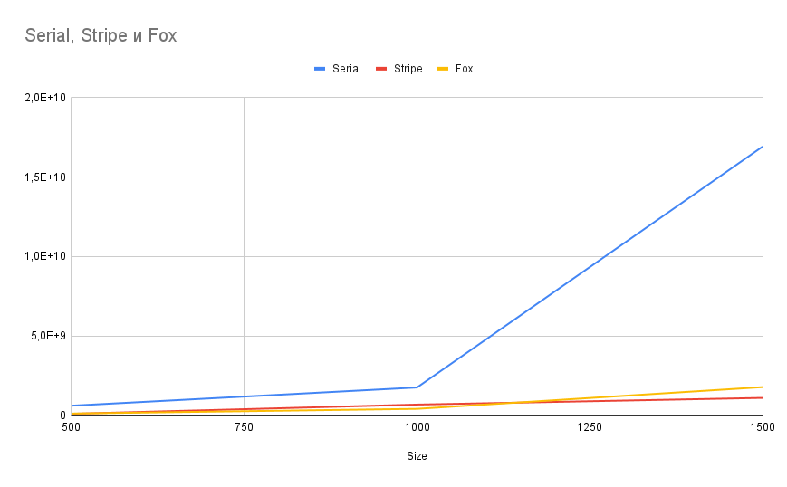
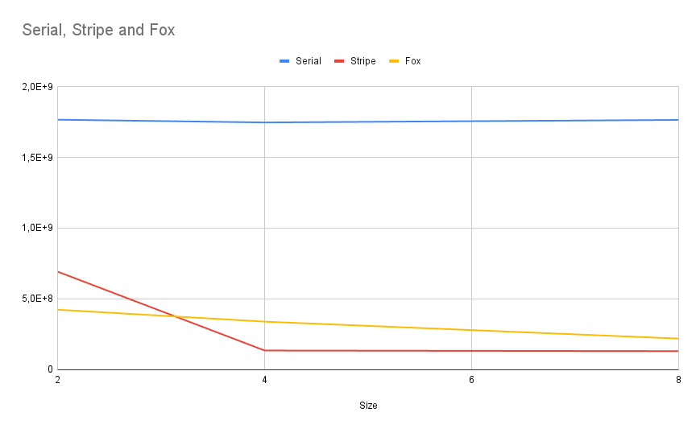

<style>
.h1c {
    text-align: center;
    font-size: 35px;
}
li {
    font-size: 20px;
}
</style>
<h1 class="h1c">Звіт

з лабораторної роботи  № 2 з дисципліни

«Технології паралельних обчислень»
</h1>

# «Розробка паралельних алгоритмів множення матриць та дослідження їх ефективності»

[//]: # (## Виконав: ІП-91 Газін Костянтин)

[//]: # ()
[//]: # ()
[//]: # (## Перевірила: Стеценко Інна Вячеславівна)


# Зміст
<p class="biggerSize">

1) [Завдання](#Завдання)
2) [Виконання](#Виконання)
3) [Висновок](#Висновок)
4) [Додаток 1](#Додаток-1)

</p>

# Завдання
1) Реалізуйте стрічковий алгоритм множення матриць. Результат множення
записуйте в об’єкт класу Result. 30 балів.
2. Реалізуйте алгоритм Фокса множення матриць. 30 балів.
3. Виконайте експерименти, варіюючи розмірність матриць, які
   перемножуються, для обох алгоритмів, та реєструючи час виконання
   алгоритму. Порівняйте результати дослідження ефективності обох
   алгоритмів. 20 балів.
4. Виконайте експерименти, варіюючи кількість потоків, що
   використовується для паралельного множення матриць, та реєструючи час
   виконання. Порівняйте результати дослідження ефективності обох
   алгоритмів. 20 балів.

# Виконання

## Зміна розмірів матриць
| Розмір таблиці | Послідовний час | Стрічковий з 2 потоками | Фокса з 4 сегментами |
|----------------|-----------------|-------------------------|----------------------|
| 500            | 621785473       | 112950076               | 128102328            |
| 1000           | 1766934768      | 691282212               | 422926460            |
| 1500           | 16915618365     | 1112288671              | 1790383339           |




## Зміна кількості потоків на матриці 1000 на 1000
| Потоки/розбиття | Послідовний час | Стрічковий  | Фокса        |
|-----------------|-----------------|-------------|--------------|
| 2	              | 1766934768	     | 691282212   | 	422926460   |
| 4	              | 1747360619	     | 134189713,5 | 	338495631,3 |
| 8	              | 1765277439	     | 130119163   | 	218777574,5 |



# Висновок
У ході роботи ми дослідили паралельне множення матриць Стрічковим методом та методом Фокса і отримали такі результати:
найбільш оптимальним методом множення матриць виявився стрічковий метод розподіений на 8 потоків, який дає середнє прискорення у 10-16 разів 


# Додаток 1
## Код для стрічкового множення

### StripeMultiplier.java
```java
public class StripeMultiplier implements IMultiplier {

    public final int threadNumber;
    public StripeMultiplier(int threads) {
        threadNumber = threads;
    }

    @Override
    public MyMatrix mult(MyMatrix a, MyMatrix b) {
        var res =  new MyMatrix(a.size);

        StripeWorker[] runs = divideThreads(a, b, threadNumber, res);
        Thread[] threads = new Thread[runs.length];
        for (int i = 0; i < runs.length; ++i) {
            threads[i] = new Thread(runs[i]);
        }
        for (int i = 0; i < runs.length; ++i) {
            threads[i].start();
        }
        try {
            for (int i = 0; i < runs.length; ++i) {
                threads[i].join();
            }
        } catch (InterruptedException e) {
            throw new RuntimeException(e);
        }
        return res;
    }

    StripeWorker[] divideThreads(MyMatrix a, MyMatrix b, int threadNumber, MyMatrix resMatrix) {
        int partitions = Math.min(a.size, threadNumber);
        int n = a.size / partitions;
        var res = new StripeWorker[partitions];
        var bts = b.transpose();
        for (int i = 0; i < partitions; ++i) {
            var start = i*n;
            var partSize = i == partitions - 1 ? Math.max(n, a.size - i * n) : n;
            var sr = new StripeWorker(start, a.getRows(start, partSize), partitions, resMatrix);
            sr.BStripes.add(bts.getRows(start, partSize));
            sr.BStarts.add(start);
            res[i] = sr;
        }
        for (int i = 0; i < partitions; ++i) {
                res[i].next = res[((i + 1) % partitions)];
        }
        return res;
    }

}
```

### StripeWorker.java
```java
import java.util.concurrent.ArrayBlockingQueue;

public class StripeWorker implements Runnable {

    public int[][] AStripes;
    private final int startRow;
    public final ArrayBlockingQueue<int[][]> BStripes;
    public final ArrayBlockingQueue<Integer> BStarts;
    public StripeWorker next;
    private final MyMatrix res;
    private int iteration;
    private final int partitions;

    public StripeWorker(int ARow, int[][] stripe, int partitions, MyMatrix result) {
        startRow = ARow;
        AStripes = stripe;
        this.partitions = partitions;
        BStripes = new ArrayBlockingQueue<>(30);
        BStarts = new ArrayBlockingQueue<>(30);
        res = result;
        iteration = 0;
    }

    @Override
    public void run() {
        while (iteration < partitions) {
            try {
                multiply();
            }catch (InterruptedException ex) {
                System.out.println("error at thread " + startRow);
                ex.printStackTrace();
            }
            iteration++;
        }
    }

    synchronized void multiply() throws InterruptedException {
        var bs = BStripes.take();
        int bStart = BStarts.take();
        for (int i = 0; i < AStripes.length; i++) {
            for (int j = 0; j < bs.length; j++) {
                for (int k = 0; k < bs[0].length; k++) {
                    res.data[i + startRow][j + bStart] += AStripes[i][k] * bs[j][k];
                }
            }
        }
        next.BStripes.put(bs);
        next.BStarts.put(bStart);

    }

}
```

## Код для множення методом Фокса

### FoxMultiplier.java

```java
import java.util.concurrent.ArrayBlockingQueue;

public class FoxMultiplier implements IMultiplier {

    int sqrtParts;

    public FoxMultiplier(int sqrtParts) {
        this.sqrtParts = sqrtParts;
    }

    @Override
    public MyMatrix mult(MyMatrix a, MyMatrix b) {
        var res = new MyMatrix(a.size);
        var partitions = sqrtParts * sqrtParts;

        FoxWorker[][] runs;
        try {
            runs = divideTasks(a, b, res);
        } catch (InterruptedException e) {
            throw new RuntimeException(e);
        }
        Thread[] threads = new Thread[partitions];
        for (int i = 0; i < sqrtParts; ++i) {
            for (int j = 0; j < sqrtParts; ++j) {
                threads[i * sqrtParts + j] = new Thread(runs[i][j]);
            }
        }
        for (int i = 0; i < partitions; ++i) {
            threads[i].start();
        }
        try {
            for (int i = 0; i < partitions; ++i) {
                threads[i].join();
            }
        } catch (InterruptedException e) {
            throw new RuntimeException(e);
        }
        return res;
    }

    public FoxWorker[][] divideTasks(MyMatrix a, MyMatrix b, MyMatrix resMatrix) throws InterruptedException {
        int partitions = sqrtParts * sqrtParts;
        var partSize = a.size / sqrtParts;
        var res = new FoxWorker[sqrtParts][sqrtParts];
        for (int i = 0; i < sqrtParts; ++i) {
            for (int j = 0; j < sqrtParts; ++j) {
                var startRow = i * partSize;
                var startColumn = j * partSize;
                res[i][j] = new FoxWorker(a.getBlock(startRow, startColumn, partSize, partSize), startRow, startColumn, i, j, sqrtParts, resMatrix);
                res[i][j].BBlocks.put(b.getBlock(startRow, startColumn, partSize, partSize));
            }
        }
        for (int i = 0; i < sqrtParts; ++i) {
            ArrayBlockingQueue<int[][]>[] aRow;
            aRow = new ArrayBlockingQueue[sqrtParts];
            for (int j = 0; j < sqrtParts; ++j) {
                res[i][j].nextB = res[(sqrtParts + i - 1) % sqrtParts][j].BBlocks;
                aRow[j] = res[i][j].ABlocks;
                res[i][j].aRow = aRow;
            }
        }
        return res;
    }
}
```

### FoxWorker.java
```java
import java.util.concurrent.ArrayBlockingQueue;

public class FoxWorker implements Runnable {

    private final int[][] a;
    ArrayBlockingQueue<int[][]> ABlocks;
    ArrayBlockingQueue<int[][]> BBlocks;

    ArrayBlockingQueue<int[][]>[] aRow;
    ArrayBlockingQueue<int[][]> nextB;

    private final int iterations;
    private int currentIteration;
    private final MyMatrix res;
    private final int startRow;
    private final int startColumn;

    private final int index;
    private final int jndex;


    public FoxWorker(int[][] a, int startRow, int startColumn, int index, int jndex, int iterations, MyMatrix result) {
        this.a = a;
        this.startRow = startRow;
        this.startColumn = startColumn;
        ABlocks = new ArrayBlockingQueue<>(3);
        BBlocks = new ArrayBlockingQueue<>(3);
        this.index = index;
        this.iterations = iterations;
        res = result;
        this.jndex = jndex;
    }

    @Override
    public void run() {
        while (currentIteration < iterations) {
            try {
                multiply();
            } catch (InterruptedException e) {
                System.out.println("error at thread " + startRow + "-" + startColumn);
                e.printStackTrace();
            }
            currentIteration++;
        }
    }

    synchronized void multiply() throws InterruptedException {
        if (jndex == (currentIteration + index) % iterations) {
            for (var q: aRow) {
                q.put(a);
            }
        }
        var as = ABlocks.take();
        var bs = BBlocks.take();

        for (int i = 0; i < as.length; i++) {
            for (int j = 0; j < bs[0].length; j++) {
                for (int k = 0; k < bs.length; k++) {
                    res.data[i + startRow][j + startColumn] += as[i][k] * bs[k][j];
                }
            }
        }
        nextB.put(bs);
    }
}
```